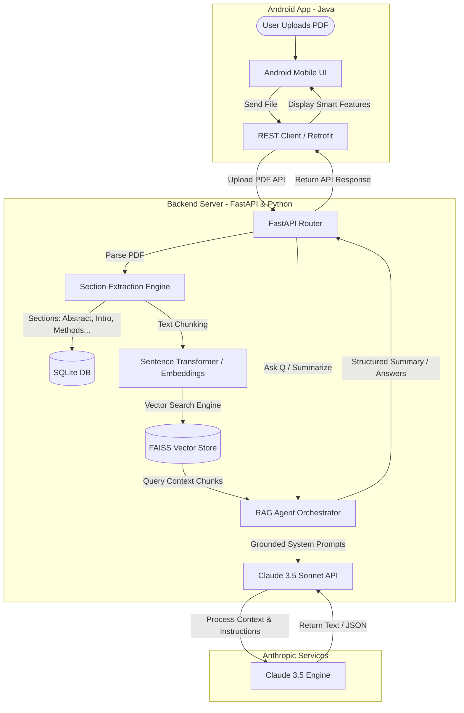

# 🎓 ScholarAI — Interactive Mobile Research Assistant

[](https://developer.android.com/)
[](https://fastapi.tiangolo.com/)
[](https://www.anthropic.com/)
[](https://sqlite.org/)
[](LICENSE)

**ScholarAI** is an AI-powered native Android mobile application designed to make dense academic research papers accessible, understandable, and highly interactive. By combining Large Language Model (LLM) intelligence with a Retrieval-Augmented Generation (RAG) pipeline, ScholarAI dismantles the steep learning curve of technical research. Users can upload any academic PDF, view summaries tailored to their expertise level (Beginner vs. Technical), and interact with a context-aware chat assistant that answers questions grounded strictly in the paper’s text—entirely eliminating AI hallucinations.

---

## 📊 App Architecture

ScholarAI functions through a seamless interaction between a native Java Android application, a fast and robust Python FastAPI backend, and Anthropic's state-of-the-art Claude 3.5 API.



---

## ✨ Features and Functionality

### 📄 Feature 1: PDF Upload & Section Parsing
*   **Simple Input Pipeline**: Upload standard academic PDFs directly from your mobile device’s local filesystem or cloud storage.
*   **Intelligent Segmentation**: Automatically extracts and segments the paper into standard scientific sections: *Abstract*, *Introduction*, *Methodology*, *Results*, *Discussion*, *Conclusion*, and *References*.
*   **Interactive Visual States**: Features a gorgeous processing screen with progress indicators so you are always updated on the backend parsing status.

### 🧠 Feature 2: Adaptive Summary Modes
*   **Beginner Mode**: Rewrites the research paper's core ideas into simple language, using real-world analogies while omitting dense academic jargon. Ideal for undergraduates and interdisciplinary readers.
*   **Technical Mode**: Preserves domain-specific terminology, statistical formulations, and methodology details, catering to graduate students and expert researchers.
*   **Tap-to-Toggle UI**: Seamlessly switch between Beginner and Technical views instantly via a sleek mobile toggle button.

### 💬 Feature 3: RAG-Based Smart Chat
*   **Hallucination-Free Q&A**: Every user question (e.g., *"What dataset did they train the model on?"*) triggers a FAISS vector search that extracts only the most relevant text chunks from the PDF.
*   **Grounded Reasoning**: These exact chunks are sent to the Claude API, forcing responses to be strictly grounded in the paper's actual text.
*   **Modern Chat UI**: Implements a clean, mobile-optimized messaging interface featuring bubble typography, quick-reply tags, and syntax highlighting for code blocks.

### 🚀 Future Enhancements
*   🃏 **Flashcard Mode**: Swipeable, AI-generated term/definition flashcards focusing on critical domain concepts in the paper.
*   🏫 **Viva/Exam Prep Mode**: AI-generated mock interview questions with hidden answer toggles to prepare students for thesis defenses or exams.
*   📁 **Multi-Paper Workspace**: Project directories to group, filter, and search across multiple uploaded papers.
*   🎙️ **Podcast Mode**: Generates a downloadable two-host conversation discussing the paper's impact, mimicking a tech podcast.

---

## 👤 Target Audience & Persona

ScholarAI is designed for anyone who interacts with scholarly journals but finds standard PDFs static and difficult to navigate:

| Target Audience | Description | Key Need |
| :--- | :--- | :--- |
| **University Students** | Undergraduate & Postgraduate students across all fields. | Needs to learn academic concepts without spending hours decoding complex notation. |
| **Academic Researchers** | Professionals reading literature outside their exact sub-specialization. | Needs to evaluate papers quickly to assess relevance for their own reviews. |
| **Self-Learners & Professionals** | Enthusiasts keeping up with advanced R&D. | Needs high-fidelity translations of heavy terminology. |

### User Persona: Hamza
*   **Profile**: 21-year-old, 3rd-year Computer Science student at a Pakistani university.
*   **Goals**: Write his bachelor's thesis literature review quickly and understand papers thoroughly.
*   **Pain Points**: Gets bogged down in statistical and mathematical methodologies, finds academic language intimidating, and struggles to formulate specific questions when he doesn't understand a concept.
*   **How ScholarAI Helps**: The app adapts technical content to his current level, helping him build scientific literacy on a device he carries everywhere.

---

## 🛠️ Technology Stack

```
 ┌────────────────────────────────────────────────────────┐
 │                   ScholarAI System                     │
 ├───────────────────┬────────────────────────────────────┤
 │ Mobile Platform   │ Native Android (Java)              │
 │ Minimum SDK       │ API 26 (Android 8.0 Oreo+)         │
 │ Backend Framework │ FastAPI (Python 3.11)              │
 │ AI Model API      │ Claude 3.5 Sonnet                  │
 │ Database Layer    │ SQLite (via SQLAlchemy)            │
 │ Vector Store      │ FAISS (Vector Indexing)            │
 └───────────────────┴────────────────────────────────────┘
```

---

## 🔧 Setup & Installation

### 1. Backend Server Setup (FastAPI)
First, clone the repository and navigate to the backend directory:
```bash
# Navigate to the backend
cd backend

# Create a virtual environment
python -m venv venv

# Activate the environment
# On Linux/macOS:
source venv/bin/activate
# On Windows:
venv\Scripts\activate

# Install required dependencies
pip install -r requirements.txt
```

Set up your `.env` configuration file in the backend root directory:
```env
ANTHROPIC_API_KEY=your_claude_api_key_here
DATABASE_URL=sqlite:///./scholar_ai.db
```

Launch the development server:
```bash
uvicorn main:app --reload --host 0.0.0.0 --port 8000
```

### 2. Mobile App Setup (Android)
1. Open **Android Studio** (Koala or newer recommended).
2. Choose **Open an Existing Project** and select the `/android` directory.
3. Allow Gradle to sync and download necessary dependencies.
4. Open `app/src/main/java/.../Config.java` (or equivalent file) and update the `BACKEND_URL` to point to your FastAPI server:
   ```java
   public static final String BACKEND_URL = "http://<YOUR_IP_ADDRESS>:8000/";
   ```
5. Connect your physical Android device or launch an emulator (API 26+) and click **Run**.

---

## 👥 Authors & Credits

This project was envisioned and developed by a dedicated team at the **University of Management and Technology, Lahore**:

*   **Husnain Aslam** — *BS Software Engineering Student*
*   **Zahira Zakki** — *BS Software Engineering Student*
*   **Haram Waheed** — *BS Software Engineering Student*
*   **Kinza Babar** — *BS Software Engineering Student*

---

## 📄 License

This project is licensed under the MIT License - see the [LICENSE](LICENSE) file for details.
